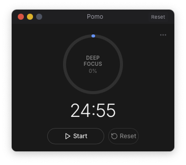
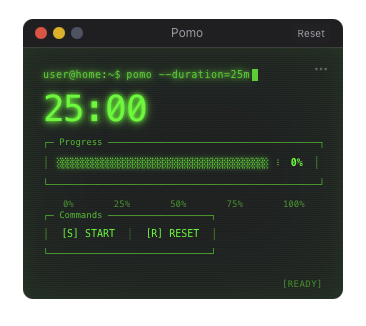
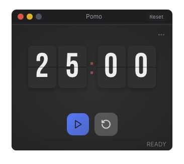
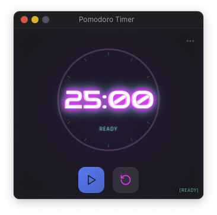
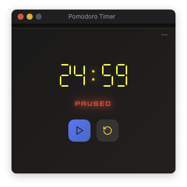
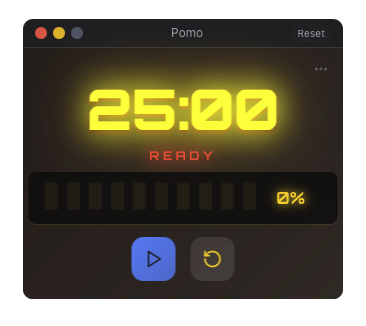

# Pomo - Minimal Floating Pomodoro Timer

A beautifully designed, floating Pomodoro timer that respects your workspace. Features multiple themes, comprehensive keyboard shortcuts, and a minimal UI that stays out of your way. Built with Tauri, React, and TypeScript.

<div align="center">
  
  
  
</div>

<p align="center">
  <em>Beautiful, minimal design that stays out of your way while keeping you productive</em>
</p>

## Why Pomo? 🍅

Stop letting timers interrupt your flow. Pomo floats elegantly above your work, collapsing to a tiny bar when you need space, expanding when you need control. It's the Pomodoro timer that finally respects your workspace.

- **Stays out of your way** - Collapse to a minimal 25:00 display with one middle-click
- **Always accessible** - Hyperkey+P brings it back instantly, no dock diving needed  
- **Multiple themes** - Choose from Default, Terminal, Rolodex, or Neon watchfaces
- **Keyboard first** - Complete keyboard control for productivity enthusiasts
- **Your timer, your rules** - Set any duration, pick your sound, customize everything

## Features

### Core Features
- 🪟 **Floating Window** - Always-on-top transparent window that floats above other applications
- 🎨 **Multiple Watchfaces** - Default (minimalist), Terminal (hacker aesthetic), Rolodex (flip clock), Neon (cyberpunk vibes)
- ⌨️ **Comprehensive Shortcuts** - Full keyboard control with helpful overlay (press `?`)
- ⏱️ **Flexible Timer** - Quick presets (1-9 keys) or custom duration with arrow keys
- 🔄 **Collapsible Design** - Middle-click the title bar to collapse/expand
- 💾 **Persistent Settings** - Your preferences are saved between sessions
- 🔊 **Sound Library** - Multiple notification sounds with volume control
- ⚙️ **Advanced Settings** - Customize opacity, sounds, shortcuts, and behavior

### Keyboard Shortcuts
Press `?` to see all shortcuts in a beautiful overlay window.

**Timer Controls**
- `S` - Start timer
- `Space` - Pause/Resume  
- `R` - Reset timer
- `Esc` - Stop timer

**Quick Duration**
- `1-9` - Set timer to 5-45 minutes (5-minute increments)
- `↑/↓` - Adjust ±1 minute
- `Shift+↑/↓` - Adjust ±5 minutes

**Interface**  
- `⌘,` - Open settings
- `T` - Cycle themes
- `M` - Toggle mute
- `H` - Hide/Show window
- `?` - Show keyboard shortcuts

## Quick Start 🚀

### Desktop App (Recommended)
```bash
# Clone and enter
git clone git@github.com:arach/pomo.git && cd pomo

# Install and run
pnpm install && pnpm tauri:dev

# That's it! Press ? to see all shortcuts
```

### Web Version (Demo/Development)
```bash
# After cloning and installing dependencies
pnpm dev

# Open http://localhost:1421/ in your browser
# Full timer functionality with localStorage persistence
```

## Getting Started

### Prerequisites

- [Node.js](https://nodejs.org/) (v16 or higher)
- [pnpm](https://pnpm.io/) (recommended) or npm
- [Rust](https://www.rust-lang.org/) (latest stable)
- [Tauri Prerequisites](https://tauri.app/v1/guides/getting-started/prerequisites)

### Installation

1. Clone the repository:
   ```bash
   git clone git@github.com:arach/pomo.git
   cd pomo
   ```

2. Install dependencies:
   ```bash
   pnpm install
   ```

3. Run in development mode:
   ```bash
   # Desktop app (recommended)
   pnpm tauri:dev
   
   # Web version for demos/development
   pnpm dev
   ```

### Building for Production

```bash
pnpm tauri:build
```

The built application will be in `src-tauri/target/release/bundle/`.

## Usage

### Timer Controls
- **Start/Pause** - Click play/pause or press `S`/`Space`
- **Reset** - Click reset or press `R`
- **Quick Duration** - Press `1-9` for 5-45 minute presets
- **Fine Tune** - Use arrow keys to adjust duration

### Window Controls
- **Move** - Drag the title bar
- **Collapse** - Middle-click the title bar
- **Theme** - Press `T` to cycle through watchfaces
- **Settings** - Press `⌘,` to open preferences

## Watchfaces Gallery 🎨

Pomo features a beautiful collection of watchfaces, each designed for different moods and workflows. Switch between them instantly with the `T` key.

<div align="center">

### **Default** - Clean & Professional ⚪


*Minimalist design with clear visual hierarchy, progress ring with session type display*

---

### **Terminal** - Hacker Aesthetic 🖥️


*Retro terminal aesthetic with green-on-black display and ASCII art progress indicators*

---

### **Rolodex** - Nostalgic Flip Clock 🔢


*Flip clock style with smooth transitions and nostalgic design*

---

### **Neon** - Cyberpunk Vibes 🌆


*Cyberpunk-inspired with glowing effects and animated progress rings*

---

### **Retro Digital** - Classic LCD 📟


*Classic digital clock aesthetic with LCD-style display*

---

### **Retro LCD** - Vintage Display 📺


*Vintage LCD display with authentic retro styling*

---

### **Chronograph** - Precision Timing ⏱️


*Professional chronograph design with precision timing display*

</div>

> **Tip:** Press `T` to cycle through all available watchfaces instantly!

## Development Features 🛠️

### Split View Comparisons

Perfect for theme development and testing! Pomo includes several split view modes to compare watchfaces side-by-side:

```bash
# Compare all watchfaces at once
pnpm dev:compare
# Opens: http://localhost:1421/?split=true

# Compare Neon V1 vs V2 (or any versions)
pnpm dev:neon  
# Opens two windows: V1 and V2 side-by-side

# Test latest V2 features
pnpm dev:v2
# Opens: http://localhost:1421/?version=v2
```

**URL Parameters for Custom Comparisons:**
- `?split=true` - Shows all watchfaces in a grid layout
- `?watchface=neon&version=v1` - Specific watchface and version
- `?watchface=terminal&version=v2` - Compare different implementations
- `?version=v2` - Test latest features

**Example Custom Comparisons:**
```bash
# Compare Terminal V1 vs V2
open 'http://localhost:1421/?watchface=terminal&version=v1'
open 'http://localhost:1421/?watchface=terminal&version=v2'

# Test specific watchface in split mode
open 'http://localhost:1421/?split=true&watchface=chronograph'
```

### Web vs Desktop Versions

- **Desktop App** (`pnpm tauri:dev`) - Full native functionality with system tray, global shortcuts, window management
- **Web Version** (`pnpm dev`) - Complete timer functionality with localStorage persistence, perfect for demos and testing

The web version automatically mocks all Tauri APIs, providing:
- ✅ Full timer functionality (start/pause/stop/reset)
- ✅ All watchfaces and themes
- ✅ Settings persistence via localStorage  
- ✅ Session naming and state management
- ✅ Keyboard shortcuts (browser-compatible)
- ❌ System tray integration
- ❌ Global shortcuts outside browser
- ❌ Window management features

## Development

### Project Structure
```
pomo/
├── src/                    # React frontend
│   ├── components/         # UI components
│   ├── stores/            # Zustand state management
│   ├── watchfaces/        # Theme configurations
│   ├── pages/             # Settings & shortcuts windows
│   ├── mocks/             # Web version API mocks
│   │   └── @tauri-apps/   # Tauri API mock implementations
│   └── App.tsx            # Main app component
├── src-tauri/             # Rust backend
│   ├── src/
│   │   ├── lib.rs         # Core timer & window logic
│   │   └── main.rs        # Entry point
│   └── tauri.conf.json    # Tauri configuration
├── specs/                 # Feature specifications
└── package.json           # Frontend dependencies
```

### Key Technologies
- **[Tauri 2.0](https://tauri.app/)** - Desktop app framework
- **[React](https://react.dev/)** - UI library
- **[TypeScript](https://www.typescriptlang.org/)** - Type safety
- **[Tailwind CSS](https://tailwindcss.com/)** - Styling
- **[Zustand](https://zustand-demo.pmnd.rs/)** - State management

## Contributing

Contributions are welcome! Please feel free to submit a Pull Request.

1. Fork the repository
2. Create your feature branch (`git checkout -b feature/AmazingFeature`)
3. Commit your changes (`git commit -m 'Add some AmazingFeature'`)
4. Push to the branch (`git push origin feature/AmazingFeature`)
5. Open a Pull Request

### Development Guidelines
- Follow the existing code style
- Write clear commit messages
- Update documentation as needed
- Test on multiple platforms if possible

## Roadmap

- [x] Multiple themes/watchfaces
- [x] Keyboard shortcuts system
- [x] Settings persistence
- [x] Menu bar/system tray integration
- [x] Session naming functionality
- [x] High-performance timer system
- [x] Web version support
- [x] Split view development tools
- [ ] Session statistics & analytics (foundation complete)
- [ ] Focus mode browser extension
- [ ] Custom theme creator
- [ ] Break timer integration
- [ ] Time tracking integrations
- [ ] Custom notification sounds upload
- [ ] Pomodoro technique presets (work/short break/long break)

## License

This project is licensed under the MIT License - see the [LICENSE](LICENSE) file for details.

## Acknowledgments

- Inspired by the need for a timer that respects your workspace
- Built with the excellent [Tauri](https://tauri.app/) framework
- UI components styled with [Tailwind CSS](https://tailwindcss.com/)
- Special thanks to the productivity community for feedback

---

Made with ❤️ by [arach](https://github.com/arach)