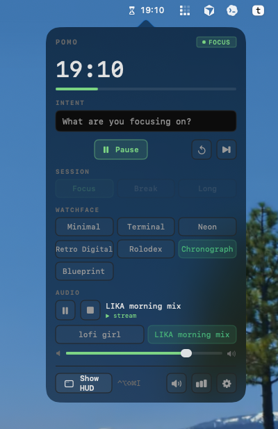
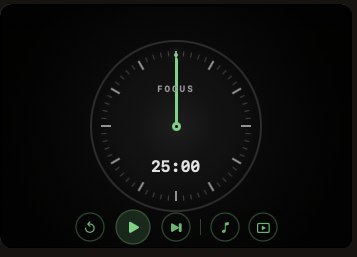
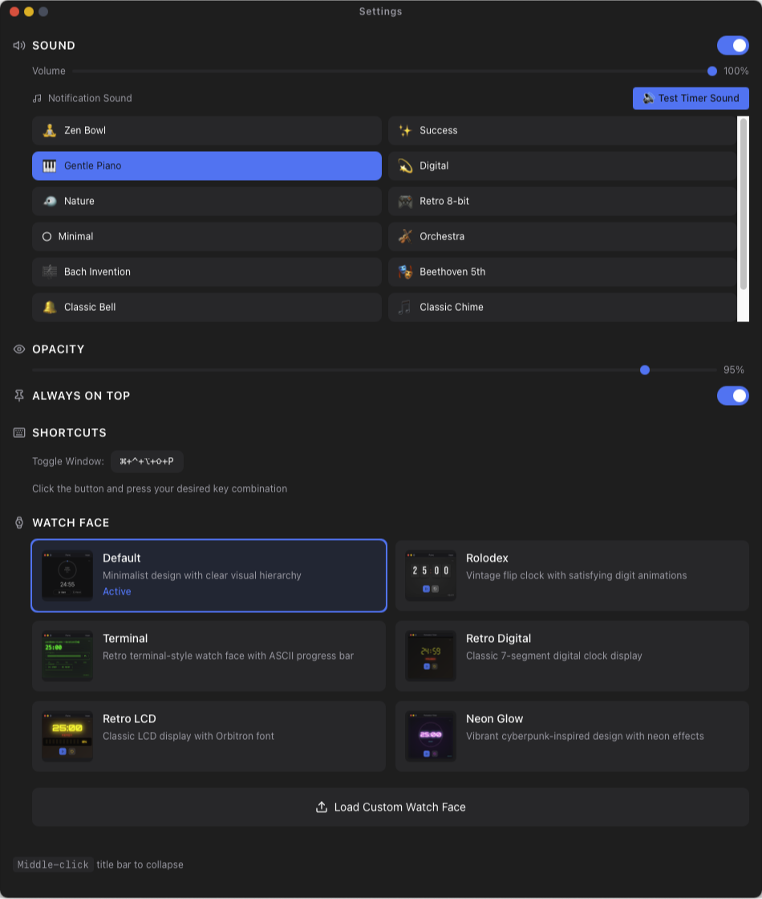

# @arach/pomo

Control — and install — the [Pomo](https://github.com/arach/pomo) macOS HUD
timer from the shell or an agent. A thin, zero-dependency wrapper over Pomo's
`pomo://` URL scheme and the JSON state file it writes on every tick.

> macOS only. It drives the installed Pomo app via `open` (and `hdiutil` for
> `install`); it doesn't bundle the app itself.

<p align="center">
  
</p>

<p align="center">
  
  &nbsp;&nbsp;
  
</p>

## Use it

No install needed — run it with `npx`:

```sh
npx @arach/pomo install     # download & install the latest Pomo.app
npx @arach/pomo start       # start a focus session
pomo                        # live terminal UI (or: pomo status for one-shot)
```

Or put it on your PATH:

```sh
npm install -g @arach/pomo
pomo
```

Run `pomo` in a terminal for a live panel — framed countdown, session, intent,
cycle dots, and quick keys (`space` pause/play, `n` skip, `h` HUD, `q` quit).
`pomo tui` opens the same view explicitly. Use `pomo status` for a one-shot
snapshot, or `pomo status --json` for scripts.

## Commands

```
Timer      tui · status [--json] · start · pause · toggle · reset · skip
           session <focus|short|long> · duration <minutes>
Intent     intent <text…> · intent clear
Audio      audio <url> · audio <play|pause|stop|next|prev>
           audio session <focus|break|long> <favorite#|url|clear> · volume <0-100>
Video      video <show|hide|toggle|page|player|browser>
Favorites  fav · fav add <url> [title…] · fav rename <n> <title…>
           fav url <n> <url> · fav move <from> <to>
           fav set <json-file|json|-> · fav play <n> · fav remove <n> · fav clear
Window     show · hide · hud · menu · face <name> · settings · stats
Login      login · login import [--browser b] [--profile p] · login profiles
           login account <n> · logout
App        install [--dry-run] [--open] · quit
```

Run `pomo help` for the full list.

### Examples

```sh
pomo intent "Writing the launch post"
pomo audio "https://youtube.com/watch?v=jfKfPfyJRdk"
pomo audio session focus 1
pomo fav play 1
pomo fav move 4 1
pomo fav set ./playlist.json
pomo status --json | jq .remainingSeconds
```

### `install`

Finds the newest GitHub release carrying a `.dmg`, downloads it, mounts it,
copies `Pomo.app` into `/Applications` (falling back to `~/Applications` if that
isn't writable), clears the download quarantine, and unmounts. `--dry-run`
prints what it would do; `--open` launches the app afterward.

## How it works

- **Commands** → `open "pomo://<verb>"` (fire-and-forget).
- **TUI / `status`** → reads `~/Library/Application Support/Pomo/state.json`.

That's the whole contract, so anything the app exposes over `pomo://` is one
line away here.